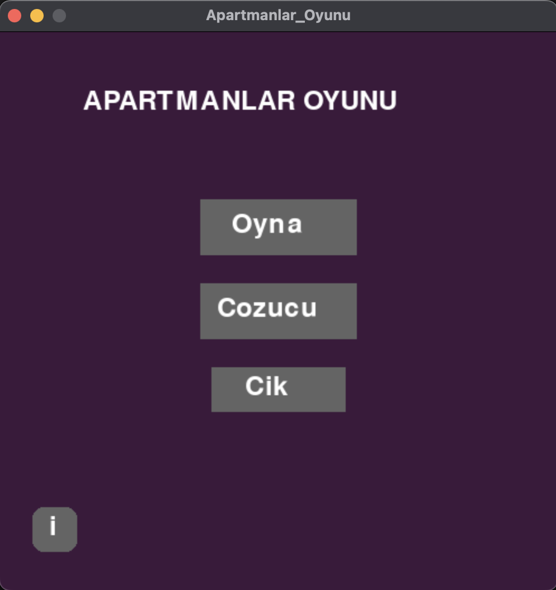
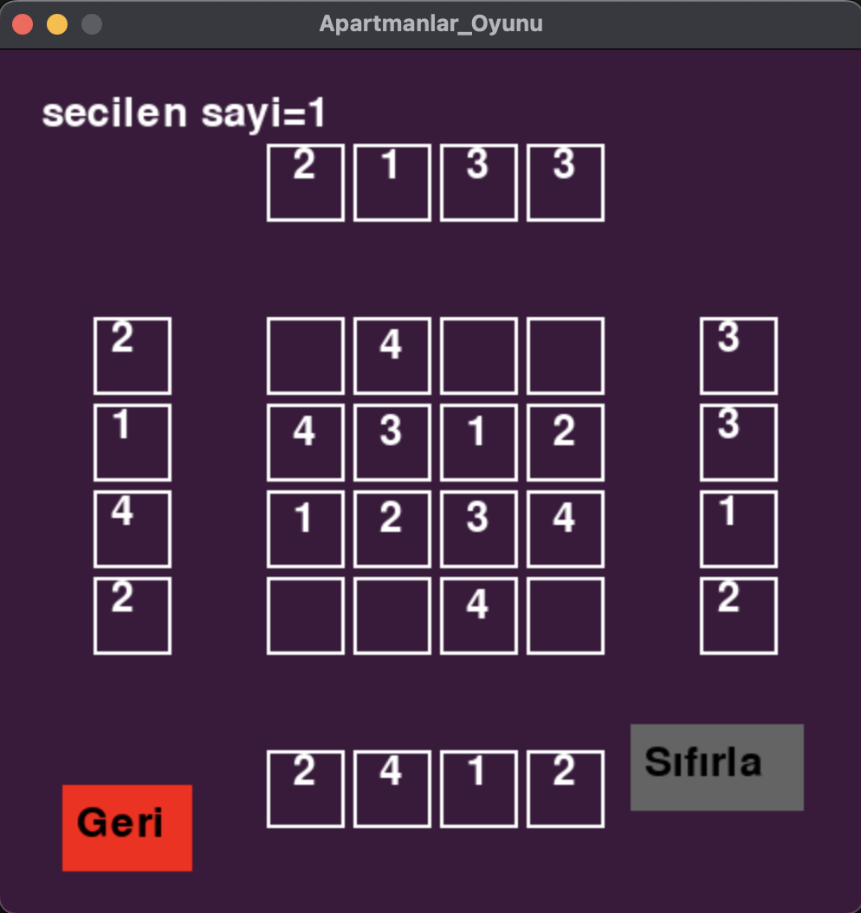
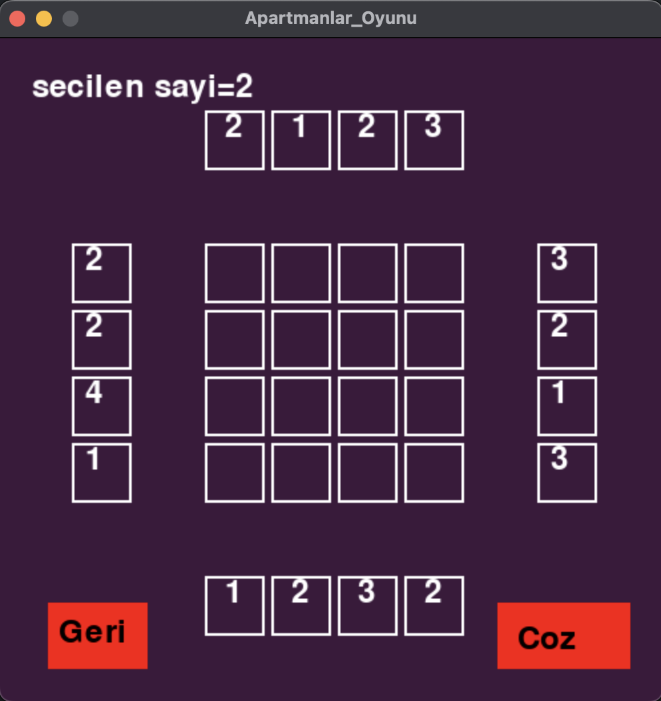

```markdown
# Skyscrapers Mind Game

A logic puzzle game where you fill a grid with skyscrapers of varying heights following clues along the edges. Each row and column must contain all numbers from 1 to N (grid size) exactly once, while the edge numbers indicate how many skyscrapers are visible from that direction.

## How to Play

1. Fill each cell with a number representing a skyscraper's height (1 to grid size)
2. Each row and column must contain each number exactly once
3. Edge numbers show how many skyscrapers are visible when looking from that direction
4. Taller skyscrapers block the view of shorter ones behind them

## Game Screenshots

### Starting Screen

Get ready to start solving puzzles!

### Puzzle Interface

A challenging puzzle awaits your solution.

### Solver Assistance

Need help? The solver can guide you through tricky puzzles.

## Video Tutorial
Watch our quick tutorial to learn how to play:  
[Skyscrapers Mind Game Tutorial](https://youtube.com/shorts/YoA0qptHH34)

## Installation

1. Ensure Python is installed on your system
2. Install Pygame:
```bash
pip install pygame
```
3. Clone this repository:
```bash
git clone https://github.com/yourusername/skyscrapers-game.git
cd skyscrapers-game
python main.py
```

# Skyscrapers Mind Game

A logic puzzle game where you fill a grid with skyscrapers of varying heights following clues along the edges. Each row and column must contain all numbers from 1 to N (grid size) exactly once, while the edge numbers indicate how many skyscrapers are visible from that direction.

## How to Play

1. Fill each cell with a number representing a skyscraper's height (1 to grid size)
2. Each row and column must contain each number exactly once
3. Edge numbers show how many skyscrapers are visible when looking from that direction
4. Taller skyscrapers block the view of shorter ones behind them

## Game Screenshots

Start your puzzle journey here!

The puzzle you will solve.

Solver will help you out when you're stuck.

## Video
Check out this short video demonstrating how the game works:
[Skyscrapers Mind Game - Video](https://youtube.com/shorts/YoA0qptHH34)

## Installation

1. Ensure Python is installed on your system
2. Install Pygame:
```bash
pip install pygame

## Features

- Multiple difficulty levels
- Built-in puzzle solver
- Interactive GUI built with Pygame
- Hint system for when you're stuck

## Game Controls

- Left click: Select a cell
- Number keys (1-N): Place a number
- Space: Check solution
- H: Get a hint
- R: Reset puzzle

## License

This project is licensed under the MIT License - see the [LICENSE](LICENSE) file for details.

---
*Skyscrapers puzzle game - A Python implementation using Pygame*
```
